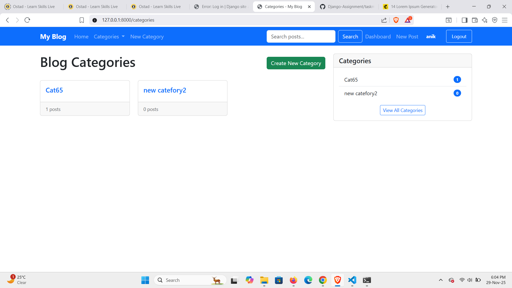
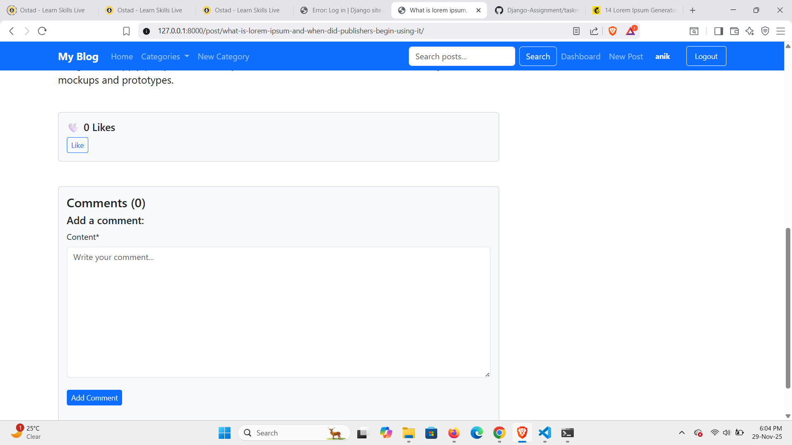
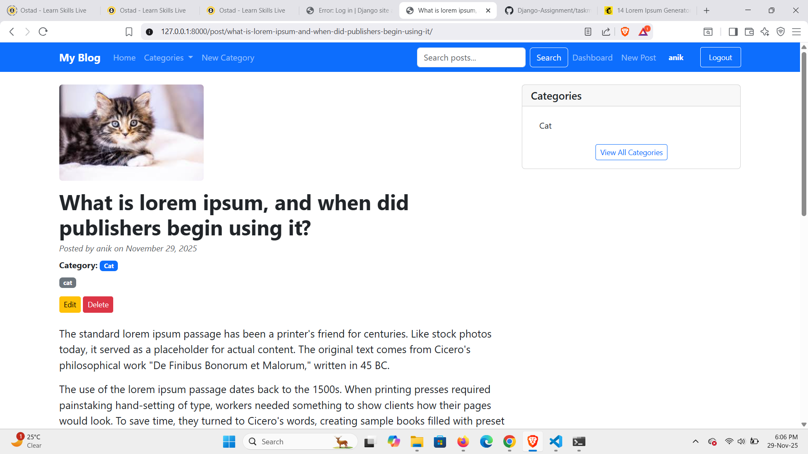

1. Clone the repository git clone (repository link) cd Blog_Site

2. Create & activate virtual environment (optional) 
    1. python -m venv venv 
    2. venv\Scripts\activate

3. Install required packages 
    1. pip install -r requirements.txt

4. Run migrations : python manage.py migrate

5. Create superuser : python manage.py createsuperuser

6. Start the server : python manage.py runserver

Visit the app: http://127.0.0.1:8000/

All UI screenshots are:

